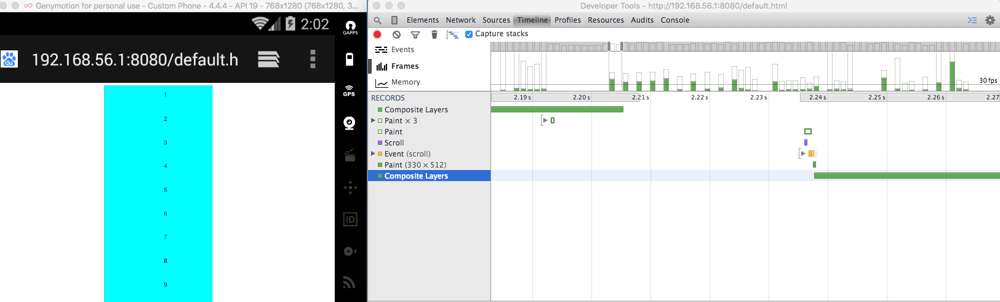

## Better-Scroll源码分析及学习(一)
>better-scroll是一款用于解决**移动端**滚动需求的插件,它非常小巧，源码为56KB，压缩并开启gzip之后，仅有8KB。

在讲解源码之前，先要说一下目前移动端滚动条方面的背景，痛点和相关的实现方案。
按照实际的业务需求，滚动条一般分为全局滚动和局部滚动，在早期的移动端，浏览器是不支持非body元素的滚动条的，当我们需要在局部的一个固定高度的容器内进行滚动内容是做不到的，这也是iScroll等类似的滚动条插件出现的原因。
在安卓4.4（不含/ios8以前，要监听scroll事件是比较麻烦的事情，因为在使用原生滚动的时候，只有在滚动完了，才会有监听的数据返回。
更严重的问题是，滚动条的性能在低端安卓机器上非常差，在我实验的使用安卓4.4系统里，多数情况下是无法达到30fps，肉眼可见的卡顿直接说明了用户体验的糟糕。


从图中可以看出滚动和页面渲染之间密切的关系，在每次触发scroll行为的时候，都会使得页面不断的重新渲染，而低端安卓机的性能并不可靠，所以滚动起来也就出现卡顿。

按照惯例，解读源码的时候我们先分析源码的结构部分。从入口开始，
作者将better-scroll的原型链通过mixin的方式分成不同的功能部分并进行扩展
```javascript
import { initMixin } from './scroll/event'
.
.
.
```
最后再统一合并并export出来
```js

initMixin(BScroll)
.
.
.

export default BScroll

```
下面就从初始化开始说起。
better-scroll是提供用户自定义配置的，所以在最开始会将你传入的参数和默认参数合并一下，同时扩展x,y,directionX和directionY用于存放滚动过程中x轴y轴上的位置和方向，然后对mouse,touch,resize,orientationchange（画面方向）事件进行了监听。
判断了
